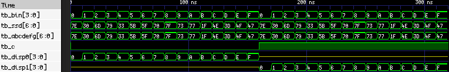

### Readme

I did not get far enough to warrant actually programming a Zedboard in the lab,
so I have no `.do` files to offer. I use \textsc{ghdl} and \textsc{Gtk}Wave on
my personal computer. If you do too, you can use:

```
ghdl analyze --std=08 bin2ssd.vhd seg7model_ent.vhd \
                      seg7model_beh.vhd tb_bin2ssd.vhd \
                      seg7ctrl.vhd tb_seg7ctrl.vhd
ghdl elaborate --std=08 tb_bin2ssd
ghdl elaborate --std=08 tb_seg7ctrl
ghdl run --std=08 tb_bin2ssd --wave=tb_bin2ssd.ghw
ghdl run --std=08 tb_seg7ctrl --wave=tb_seg7ctrl.ghw
```

### Exercises

a) Sample `tb_bin2ssd.vhd` run:

   

b) I chose to alternate the displays at at least \SI{50}{Hz}. I then need to
   calculate the number of \SI{100e6}{Hz} cycles fit in \SI{50}{Hz}, which is
   given by $$ \frac {\SI{100e6}{Hz}} {\SI{50}{Hz}} = \num{2e6}. $$ The
   appropriate amount of bits is given by $\lfloor\log_2 \num{2e6}\rfloor
   = 20$, I round down get a faster (rather than slower) counter. More
   precisely, this gives a refresh rate of $\approx \SI{95}{Hz}$.

   A possible schematic of the entity `seg7ctrl` is shown in figure
   \ref{diagram}. Waveform from a sample `tb_seg7ctrl.vhd` run is shown in figure \ref{b}.

   


   

c) See files for implementation. One clock cycle is _fast_, one billionth of
   a second, if I've interpreted correctly. This makes the waveform really
   unwieldy, and difficult to test. The letters couldn't possibly be legible at
   this speed?

d) `TODO!`
